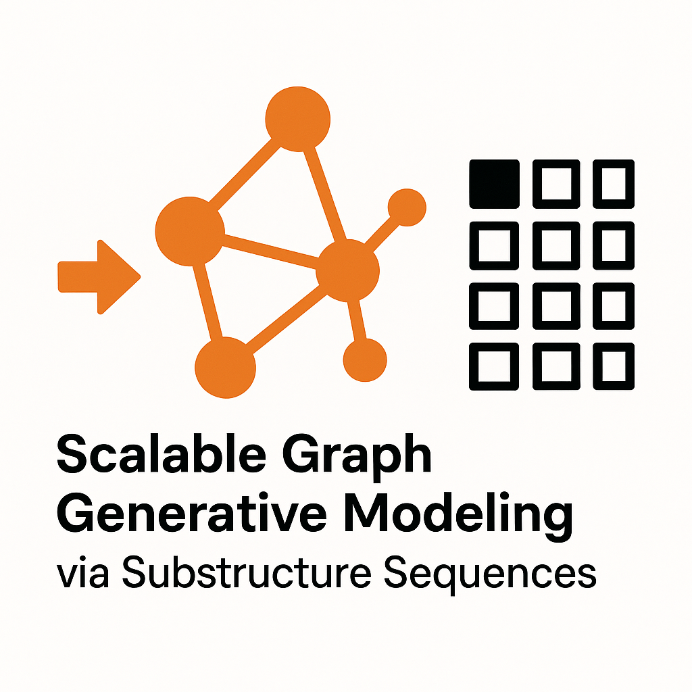
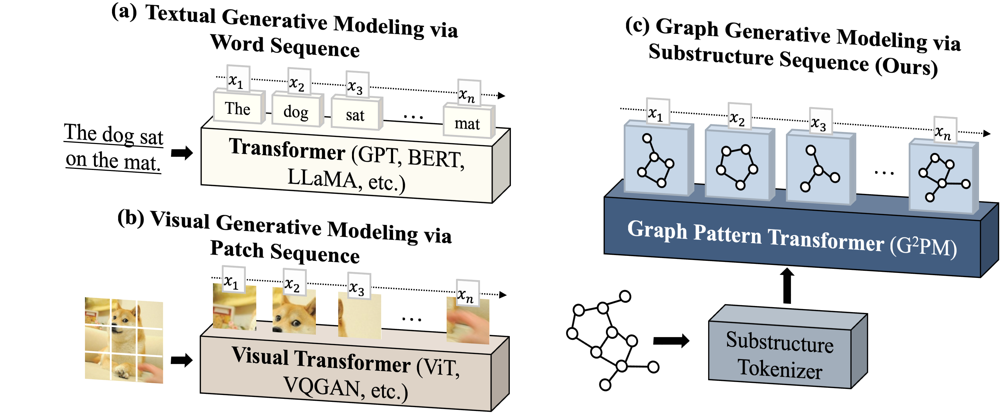
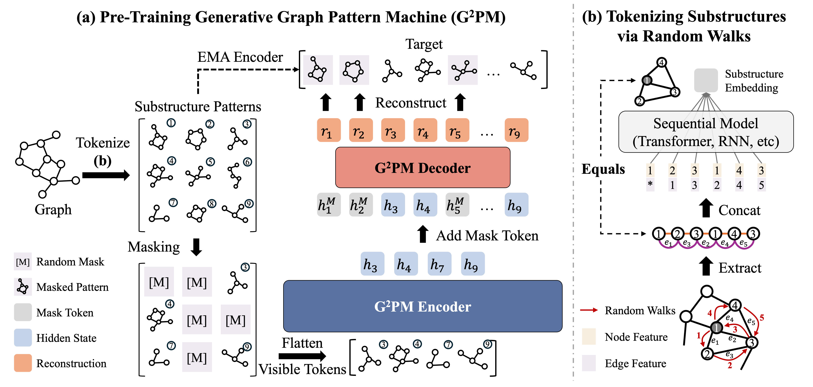

# Scalable Graph Generative Modeling via Substructure Sequences (G2PM)

<div align='center'>

[](https://pytorch.org/get-started/locally/)
[](https://pytorch-geometric.readthedocs.io/en/latest/install/installation.html)

[](https://arxiv.org/abs/2505.16130)


</div>

## 📝 Description

This is the official implementation of our paper [Scalable Graph Generative Modeling via Substructure Sequences](https://arxiv.org/abs/2505.16130), a self-supervised extension of our ICML'25 work [GPM](https://arxiv.org/abs/2501.18739). G2PM addresses the fundamental scalability challenges in Graph Neural Networks (GNNs) by introducing a novel approach that goes beyond traditional message-passing architectures.

### Key Features



- 🚀 Breakthrough scalability with continuous performance gains up to 60M parameters

- 🔄 Novel sequence-based representation replacing traditional message passing

- 🎯 Versatile performance across node, graph, and transfer learning tasks

- ⚡ Optimized architecture design for maximum generalization capability


### Background & Motivation
Traditional message-passing GNNs face several critical limitations:
- Constrained expressiveness
- Over-smoothing of node representations
- Over-squashing of information
- Limited capacity to model long-range dependencies

These issues particularly affect scalability, as increasing model size or data volume often fails to improve performance, limiting GNNs' potential as graph foundation models.


### Framework Overview



G2PM introduces a generative Transformer pre-training framework that:
1. Represents graph instances (nodes, edges, or entire graphs) as sequences of substructures
2. Employs generative pre-training over these sequences
3. Learns generalizable and transferable representations without relying on traditional message-passing

### Empirical Results
- Demonstrates exceptional scalability on ogbn-arxiv benchmark
- Continues performance improvement up to 60M parameters
- Significantly outperforms previous approaches that plateau at ~3M parameters
- Shows strong performance across node classification, graph classification, and transfer learning tasks

## 🛠️ Installation

### Prerequisites
- CUDA-compatible GPU (24GB memory minimum, 48GB recommended)
- CUDA 12.1
- Python 3.9+

### Setup
```bash
# Create and activate conda environment
conda env create -f environment.yml
conda activate GPM

# Install DGL
pip install dgl -f https://data.dgl.ai/wheels/torch-2.4/cu121/repo.html

# Install PyG dependencies
pip install pyg_lib torch_scatter torch_sparse torch_cluster torch_spline_conv -f https://data.pyg.org/whl/torch-2.4.0+cu121.html
```

## 🚀 Quick Start
The code of G2PM is presented in folder `/G2PM`. You can run `pretrain.py` and specify any dataset to run experiments. To ensure reproducability, we provide hyper-parameters in `config/pretrain.yaml`. You can simply use command `--use_params` to set tuned hyper-parameters. 

### Basic Usage
```bash
# Run with default parameters
python G2PM/pretrain.py --dataset computers --use_params
```

### Supported Tasks & Datasets

1. **Node Classification**
   - `pubmed`, `photo`, `computers`, `arxiv`, `products`, `wikics`, `flickr`.  

2. **Graph Classification**
   - `imdb-b`, `reddit-m12k`, `hiv`, `pcba`, `sider`, `clintox`, `muv`. 

We also provide the interfaces of other widely used datasets in [GPM](https://github.com/zehong-wang/GPM). Please check the datasets in `G2PM/data/pyg_data_loader.py` for details. 


## 🔧 Configuration Options

### Basic Parameters
- `--use_params`: Use tuned hyperparameters
- `--dataset`: Target dataset name
- `--epochs`: Number of training epochs
- `--batch_size`: Batch size
- `--lr`: Learning rate

### Pretraining Parameters
- `--pre_sample_pattern_num`: Number of patterns per instance in total (used for pattern extraction)
- `--num_patterns`: Number of patterns per instance during training (used for pattern encoding)
- `--pattern_size`: Pattern size (random walk length)
- `--mask_token`: Mask token type (`learnable`, `random`, `fixed`, `replace`)
- `--architecture`: Reconstruction architecture (`mae`, `simmim`)

### Model Architecture
- `--hidden_dim`: Hidden layer dimension
- `--num_heads`: Number of attention heads
- `--num_enc_layers`: Number of Transformer layers in encoder
- `--num_dec_layers`: Number of Transformer layers in decoder
- `--dropout`: Dropout rate

### Augmentation
- `--mix_aug`: Mix the augmentation strategies
- `--mask_node`: Mask node features
- `--mask_pattern`: Mask graph patterns

For complete configuration options, please refer to our code documentation.

## 📂 Repository Structure
```
└── G2PM
    ├── G2PM/             # Main package directory
    │   ├── data/         # Data loading and preprocessing
    │   ├── model/        # Model architectures
    │   ├── task/         # Task implementations
    │   ├── utils/        # Utility functions
    │   ├── pretrain.py   # Pretraining script
    ├── config/           # Configuration files
    ├── assets/           # Images and assets
    ├── data/             # Dataset storage
    ├── patterns/         # Extracted graph patterns
    └── environment.yml   # Conda environment spec
```

## 📚 Citation

If you find this work useful, please cite our paper:

```bibtex
@article{wang2025scalable,
  title={Scalable Graph Generative Modeling via Substructure Sequences},
  author={Wang, Zehong and Zhang, Zheyuan and Ma, Tianyi and Zhang, Chuxu and Ye, Yanfang},
  journal={arXiv preprint arXiv:2505.16130},
  year={2025}
}
```

## 👥 Authors

- [Zehong Wang](https://zehong-wang.github.io/)
- [Zheyuan Zhang](https://jasonzhangzy1757.github.io/)
- [Tianyi Ma](https://tianyi-billy-ma.github.io/)
- [Chuxu Zhang](https://chuxuzhang.github.io/)
- [Yanfang Ye](http://yes-lab.org/)

For questions, please contact `zwang43@nd.edu` or open an issue.

## 🙏 Acknowledgements

This repository builds upon the excellent work from:
- [GPM](https://github.com/zehong-wang/GPM)
- [PyG](https://github.com/pyg-team/pytorch_geometric)
- [OGB](https://github.com/snap-stanford/ogb)
- [VQ](https://github.com/lucidrains/vector-quantize-pytorch)

We thank these projects for their valuable contributions to the field.
